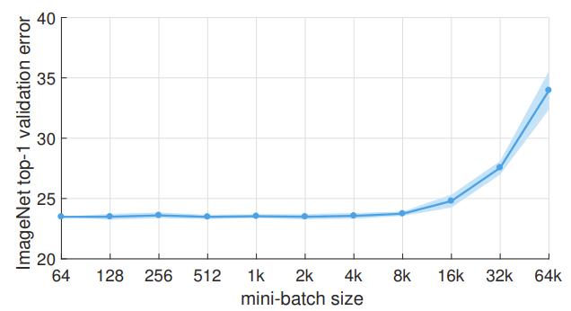

# Accurate, Large Minibatch SGD: Training ImageNet in 1 Hour

## Paper Summary
#### What is the paper about? Please, be concise (3 to 5 sentences)
This paper is about training ImageNet faster (claimed to be within 1 hour). It shows that while naively increasing batch sizes of images used during training to decrease training time can degrade performance (accuracy), fixing optimization difficulties can prevent performance degradation.

|  |
|:--:|
| Shows the preservation of validation accuracy at large batch sizes (< 8k). After 8k, the accuracy starts degrading. (why?) |

The paper employs a rule for adjusting the learning rate as a function of minibatch size, as well as employing a warmup scheme to overcome early training optimization issues.
They go from training a ResNet50 model with a minibatch of 256 images on 8 Tesla P100 GPUs in 29 hours, to training with a minibatch size of 8192 images on 256 GPUs in 1 hour, without degrading accuracy.

## Paper Motivation
#### Why is this paper important?
Training models on imagenet is a very slow process often taking days with small compute power. Previous work (Krizhevsky et. al.) showed that increasing the minibatch size from 128 to 1024 saw a 1% increase in error. However this paper nullifies the error loss up to 8k minibatch size.

## Paper Methodology
#### What novel methodology does this paper introduce? Be as detailed as possible.
- Linear Scaling rule
  - They employ a *linear scaling rule*, a hyper-parameter free approach to adjust learning rate. Its key idea being: **Linear Scaling Rule: When the minibatch size is multiplied by k, multiply the learning rate by k.** And all other hyper-parameters like weight decay, etc. are kept unchanged.
  - An intuition for this is gathered by looking at the SGD update between two scenarios: 1) k minibatches summing to B, and 2) 1 'minibatch' of size B. See equations 3 and 4. The differences are subtle, but if the two gradients in the summation are equivalent, then the linear scaling with k as minibatch size makes sense. But this assumption is a little loose.
- Warmup
  - Constant warmup: using a low constant learning rate (neta) for the first few epochs of training (prior work) -> does not work for this paper because it causes training error spikes when going from small learning rate to large (k*neta) learning rates
  - Gradual warmup: a slowly increasing learning rate. In practice start from small learning rate neta and increment it by constant amount at each iteration such that it reaches k*neta after 5 epochs.
- Batch Norm
  - Eqns. 1 and 2 suggest that per sample loss *l* is independent of other samples, but this is not true when batch norm layers are present.
  - Keeping the per worker (GPU) size of 32 constant works well in practice.
- Subtleties to keep in mind with weight decay, momentum correction, gradient aggregation, data shuffling
- Communication between GPUs sometimes becomes a botteneck during the reduceall operation (gradients partial sums across GPUs need to be combined) in the backprop step when a large number of GPUs are used. But apparently it was not the case with the scale of this paper.

Table describing training parameters

| Parameter   | Value |
| ----------- | ----------- |
| Momentum Type    | Nesterov        |
| Momentum   | 0.9        |
| Weight Decay   | 0.0001    |
| Epochs  | 90        |
| Per GPU batch size (n)  | 32        |
| Workers, i.e. #GPUs (k) | 8 |
| reference learning rate (neta) | 0.1 * k*n / 256 |
| learning rate decay | 1/10 @ 30, 60, 80 |

## Paper Strengths
#### Please discuss, justifying your comments with the appropriate level of details, the strengths of the paper
<!--  (i.e. novelty, theoretical approach and/or technical correctness, adequate evaluation, clarity, etc). For instance, a theoretical paper may need no experiments, while a paper with a new approach may require comparisons to existing methods. -->
A seeming reasonable approach has been proposed in this paper. Compared to existed methods, this work seems to achieve better results.

## Paper Weaknesses
#### Please discuss, justifying your comments with the appropriate level of details, the weaknesses of the paper
<!-- (i.e. lack of novelty – given references to prior work-, lack of novelty, technical errors, or/and insufficient evaluation, etc). Note: If you think there is an error in the paper, please explain why it is an error. Also remember that theoretical results/ideas are essential to CVPR (some theoretical papers may not need to have experiments). If the theory is novel and interesting, but the results did not outperform other existing algorithms, it is not necessarily a reason to reject. It is not appropriate to ask for comparisons with unpublished papers and papers published after the CVPR deadline. In all cases, please be polite and constructive. CVPR 2018 policy on dual submission and arxiv appears at: http://cvpr2018.thecvf.com/submission/main_conference/author_guidelines.	However, as to the novelty and the experimental results, I have the concerns as follows: -->

1. It is challenging to reproduce method and reproduce results due to the need of a large number of GPUs.

2. It is unclear how changing *n* (number of samples per GPU) changes the performance of the model.

## Key Quotes from Paper
- While the strategy we deliver is simple, its successful application requires correct implementation with respect to seemingly minor and often not well understood implementation details within deep learning libraries. Subtleties in the implementation of SGD can lead to incorrect solutions that are difficult to discover.
- The linear scaling rule can help us to not only match the accuracy between using small
and large minibatches, but equally importantly, to largely match their training curves, which enables rapid debugging and comparison of experiments prior to convergence.
- There are at least two cases when the condition gradient l(x, wt) != gradient l(x, wt+j) will clearly not hold.     
  - First, in initial training when the network is changing rapidly, it does not hold. We address this by using a warmup phase, discussed in §2.2.
  - Second, minibatch size cannot be scaled indefinitely: while results are stable for a large range of sizes, beyond a certain point accuracy degrades rapidly. Interestingly, this point is as large as ~8k in ImageNet experiments.
- If *n* (per-worker sample size) is adjusted, it should be viewed as a hyper-parameter of BN, not of distributed training. We also note that the BN statistics should not be computed across all workers, not only for the sake of reducing communication, but also for maintaining the same underlying loss function being optimized.

## Learning from the paper
- The bottleneck of being able to use just n=32 samples per GPU limits us to use a maximum batch size of 256. The paper is not clear about what happens if we increase *n*, neither from a theoretical nor empirical perspective.
- The ResNet50 training curves can be used as blueprints for our own training pipelines. The learning rate decay strategy they use seems to work well, which we already (kind of) apply.
